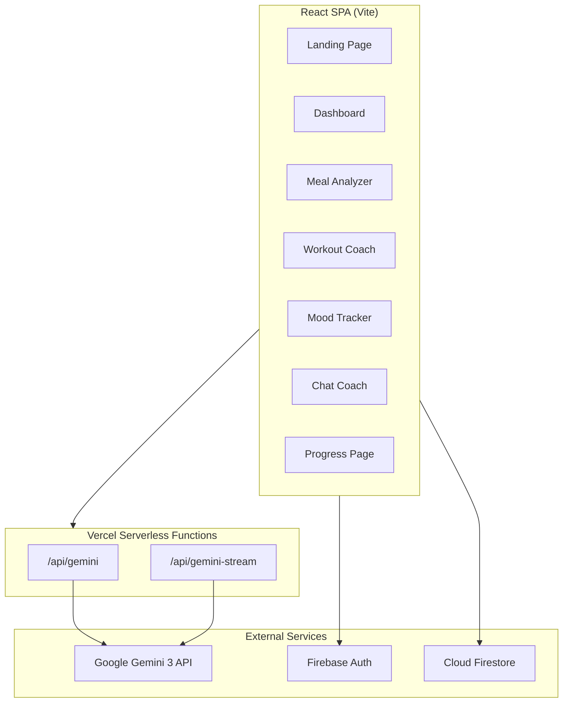
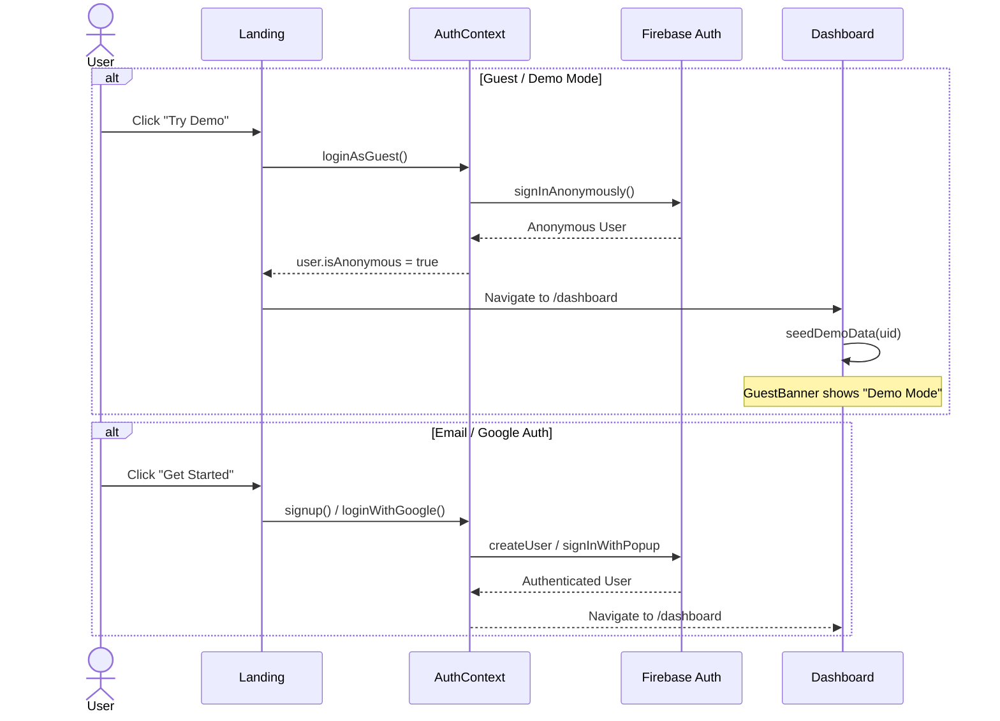
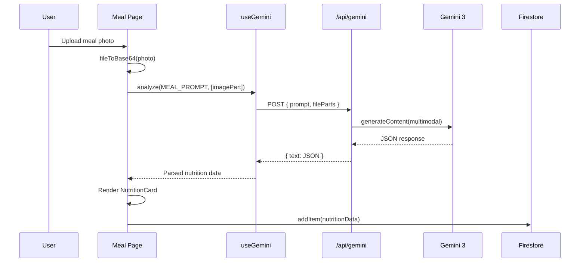
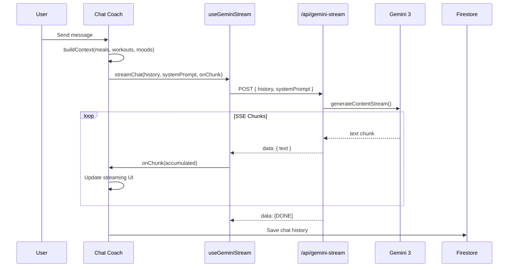
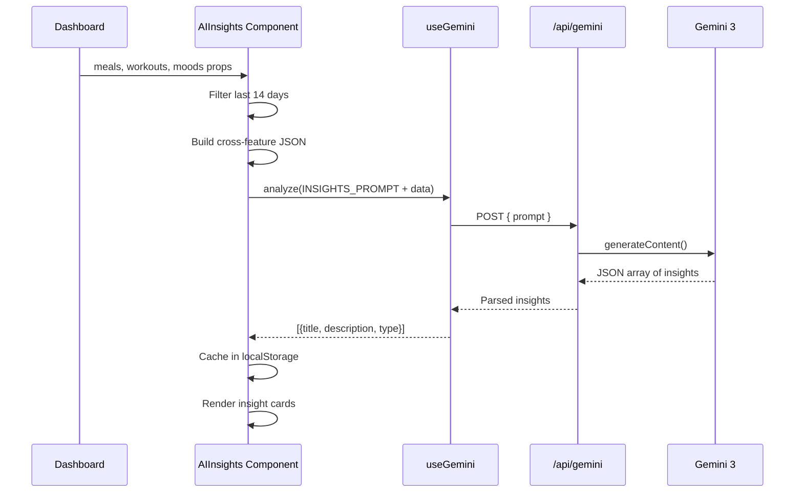

# Health Harmony — Architecture

## System Overview

## Authentication Flow

## Meal Analysis Flow

## Streaming Chat Flow

## AI Insights Flow (Cross-Feature)

## Tech Stack

| Layer | Technology |
|-------|-----------|
| Frontend | React 18, Vite, Tailwind CSS |
| Routing | React Router v6 |
| State | React Context + Hooks |
| AI | Google Gemini 3 API (multimodal + streaming) |
| Auth | Firebase Authentication (email, Google, anonymous) |
| Database | Cloud Firestore (real-time) |
| Hosting | Vercel (SPA + serverless functions) |
| API | Vercel Serverless Functions (Node.js) |
